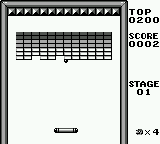
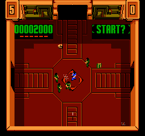
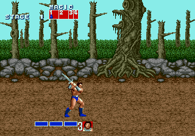

# Mindcamp X gym-retro talk companion code and images

## Introduction

Here you'll find the code I build while learning the basics of [gym-retro](https://blog.openai.com/gym-retro/) and the "videos" (animated GIFs) I recorded for my [MindCamp X talk](https://slides.kartones.net/028.html).

The most interesing agent and code is the Golden Axe [JERK](https://www.noob-programmer.com/openai-retro-contest/jerk-agent-algorithm/) agent, which is based on the official Open-AI algorithm but I adapted to play this videogame by looking at how it worked with Sonic (as it uses undocummented LUA scripting to achieve less basic reward logic than the configuration-based one).

## Setup

TBD

## Agents

I provide the code for three games, each with miscellaneous agents:

### Alleway (GameBoy)

- A fully random agent
- A basic non-reinforcement learning AI (just tries to follow the ball with the paddle)
- An epison greedy agent (not very useful in this game)

### Smash TV (Nintendo NES)

- A fully random agent
- A decaying epsilon greedy agent

### Golden Axe (SEGA Megadrive/Genesis)

- A decaying epsilon greedy agent
- A JERK agent

