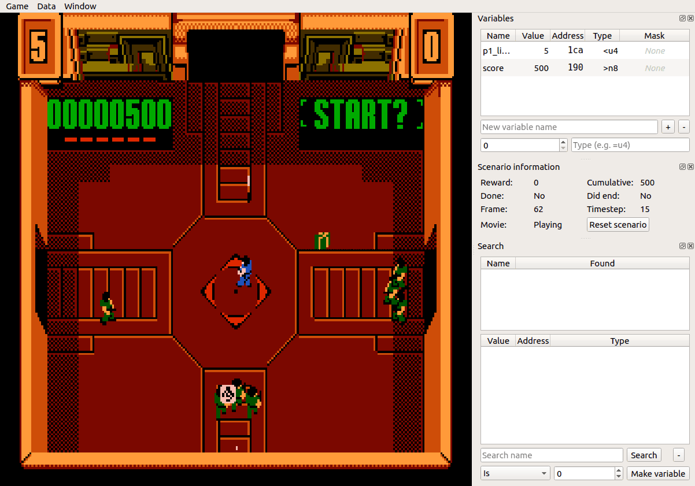

# Mindcamp X gym-retro talk companion code and images

## Introduction

Here you'll find the code I build while learning the basics of [gym-retro](https://blog.openai.com/gym-retro/) and the "videos" (animated GIFs) I recorded for my [MindCamp X talk](https://slides.kartones.net/028.html).

The most interesing agent and code is the Golden Axe [JERK](https://www.noob-programmer.com/openai-retro-contest/jerk-agent-algorithm/) agent, which is based on the official Open-AI algorithm but I adapted to play this videogame by looking at how it worked with Sonic (as it uses undocummented LUA scripting to achieve less basic reward logic than the configuration-based one).



## Setup

```
pip3 install gym-retro
```

If you wish to use the Integration GUI, you must also [download the sources](https://github.com/openai/retro/tree/master) and [compile it](https://github.com/openai/retro/tree/master#linux). Note that, even launching the GUI from the downloaded sources folder, you must load data files and games from the pip installed package (e.g. `~/.local/lib/python3.6/site-packages/retro/data`).

Then to launch the GUI is very easy:
```
gym-retro$ ./gym-retro-integration
```

To list all environments/games available, place inside any agent file:
```
print(retro.data.list_games())
exit(0)
```

To import games (usually USA ROMs or Steam's SEGA Classics):
```
sha1sum <path_to_rom>
# compare with  gym-retro/retro/data/stable/<game_name>/rom.sha, and if matches:
python3 -m retro.import <path_to_rom>
```

To launch any agent, go to its subfolder and, assuming you've already imported the ROM, just run `python3 <agent-file.py>`. All of them use a `config.py` file where you can easily change the scenario, number of steps to render between action changes, and the like.


## Agents

I provide the code for three games, each with miscellaneous agents:

### Alleway (GameBoy)

- A fully random agent
- A basic non-reinforcement learning AI (just tries to follow the ball with the paddle)
- An epison greedy agent (not very useful in this game)


### Smash TV (Nintendo NES)

- A fully random agent
- A decaying epsilon greedy agent


### Golden Axe (SEGA Megadrive/Genesis)

- A decaying epsilon greedy agent
- A JERK agent (based on Sonic one from OpenAI)


## TO-DOs

Mostly for the Golden Axe JERK agent, I wish I had more time to work on a few things, mostly:
- Storing a `num_frames_without_reward` (or with a tiny reward ) and if bigger than a thresold, return True in the done function. This would probably fix the issue of AI enemies going left and the agent going right (so the screen gets stuck).
- I didn't wanted the agent to be too complex (and thus, require way more time to train), so doesn't moves up, down, neither jumps or uses the special attack.

And in general:
- Config files evolved with the agents, so the Golden Axe JERK agent uses the most "advanced" config file, having parametrized most data fields. Building a base agent with the proper config and then just swapping the "AI" algorithm would be nice.
- Allowing (via keypress) to toggle rendering on/off would be great to speed up training. Same with recording, to ignore first scenarios/runs but start after a while
